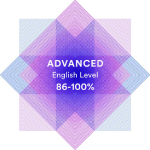

## [rsshool-cv](https://rs.school/)

---

Margarita Zakharova
========================
### Junior Frontend Developer
***
### 📞 Contact information:
**Phone:** +48 571 865 025  
**E-mail:** <margodevalois@gmail.com>  
[Telegram](https://t.me/alko_fox)  [GitHub](https://github.com/Margodevalois/) [LinkedIn](https://www.linkedin.com/in/margarita-zakharova-4a2392139/) [Behance](https://www.behance.net/8bfa4e0f "Link to my Behance profile")  
***
### 👋 A few words about me:  
I has just started my journey in web development. And I have a great desire to learn in this sphere.  
I’m interested in Web Development because this occupation provides endless possibilities for professional growth,
besides there’s a huge amount of free high quality resources for self-education and a large community of developers. I have a great desire to work on a real commercial project in a strong team, under the guidance of an experienced mentor.
And for this I do my very best to develop my professional skills.

***

### 🤹 Skills
- HTML5, CSS3
- Basic knowledge of JavaScript, C, MySQL
- Version control: Git (GitHub, GitLab)
- Tools: VS Code, Adobe Photoshop, Illustrator, CorelDraw, ZBrush, Blender
- Data Visualization: Excel, Google Sheets
- Video & audio editing
###### 🤹 SoftSkills
- [x] Motivated and well-disciplined
- [x] Communicative and open-minded
- [x] Hardworking and persistent
- [x] Quick learner
- [x] Good at time management

***

### 🌝 Code example:  
```
<!DOCTYPE html>
<html>
 <head>
  <meta charset="utf-8">
  <title>Title</title>
    <style>
        p { color:  navy; }
    </style>
 </head>
 <body>
    <p>HTML5</p>
 </body>
</html>
 ```
***

### ✨ Experience:  
- [Wed-Art:](https://wed-art.com/) - desinger of wedding printed items, 2018-2022;
- [EON Games:](https://eon-games.com/) - icon game-desinger for different platforms (Google Play Market, AppStore, etc.), 2015-2017;
- [InterCars:](https://www.intercars-tickets.com/) - system administrator of clients DB, 2013-2014;
##### Projects
- [ ] CV.Markdown

***

### 👩‍🎓 Education:
* [<strong>Minsk State Linguistic College</strong>](https://lgk.mslu.by/)
    - Faculty of linguistic support of socio-cultural activities, 2009-2013  
* [<strong>Belorussian State University, School of business</strong>](https://sb.bsu.by/en)
    - Faculty of Information Resourses  Managment, 2013-2018
### 📝 Courses:  
* Zbrush from the very begining on the [Udemy](https://www.udemy.com/course/zbrushfromzero/) (completed) <br />
* Legacy Responsive Web Design on the [freeCodeCamp](https://www.freecodecamp.org/learn/responsive-web-design/) (in progress) <br />
* Front-End Development in RSSchool (in progress)

***

### 💬 Languages:
|                                    |                                |  
| --- | --- |
| **Russian:** Native | **German:** B1 |
| **Belarusian:**: Native | **Spanish:** A2 |
| **Polish:** Basic (in progress) |
| **English:** Upper-Intermediate: | *[EPAM English test result](https://examinator.epam.com/Main/PersonalAssignments) B2* |
| | *[StreamLine Language School English test result](https://examinator.epam.com/Main/PersonalAssignments) Advanced (CEFR C1)* |
| | _[EF SET test result](https://examinator.epam.com/Main/PersonalAssignments) Advanced (between C1 Advanced and C2 Proficient)_ |

